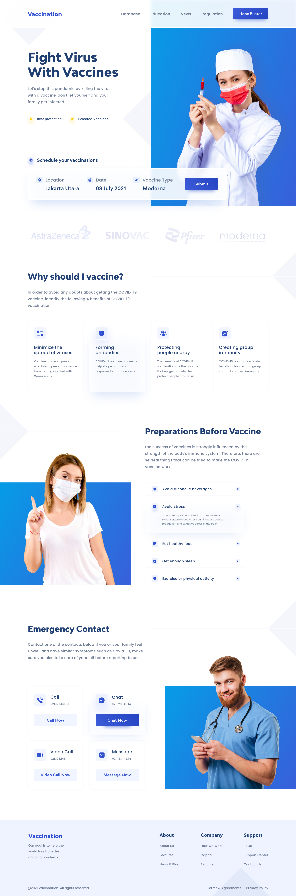

# CSSFrontEnd

Este repositorio contiene la práctica de la Semana 3 correspondiente al curso de **LaunchX**.

Esta práctica consiste en clonar la plantilla de una [página de vacunación](https://dribbble.com/shots/16001939-Vaccination-Vaccine-landing-page-website). 

El objetivo de esta práctica era hacer uso de las herramientas, tanto de _HTML_ como de _CSS_, de tal manera que la página quedará lo más similar posible.

En este intento de clonación, se usaron las siguientes imágenes:

* [Female doctor](https://www.freepik.com/free-photo/front-view-female-nurse-white-medical-suit-with-red-mask-injection-her-hands-blue_13935723.htm?query=nurses%20%20nursing#position=30&query=nurses++nursing)
* [Woman](https://www.freepik.com/free-photo/front-view-young-woman-sterile-mask-yellow-wall_12651631.htm#&position=4&from_view=author)
* [Male doctor](https://www.freepik.com/free-photo/portrait-man-doctor-using-cellphone_7844038.htm#query=doctor%20with%20phone&position=1&from_view=author)

Además, se utilizaron diferente íconos obtenidos de las siguientes fuentes:

* [Font Awesome](https://fontawesome.com/)
* [Google Font Icons](https://fonts.google.com/icons)
* [Health Icons](https://healthicons.org/)
* [FreeIcons](https://www.iconshock.com/freeicons/)

Y, fuentes obtenidas de:

* [Google Fonts](https://fonts.google.com/)

Por otro lado, la página desplegada se puede encontrar en el siguiente enlace: [Vaccination](https://vaccination-template.netlify.app/).
